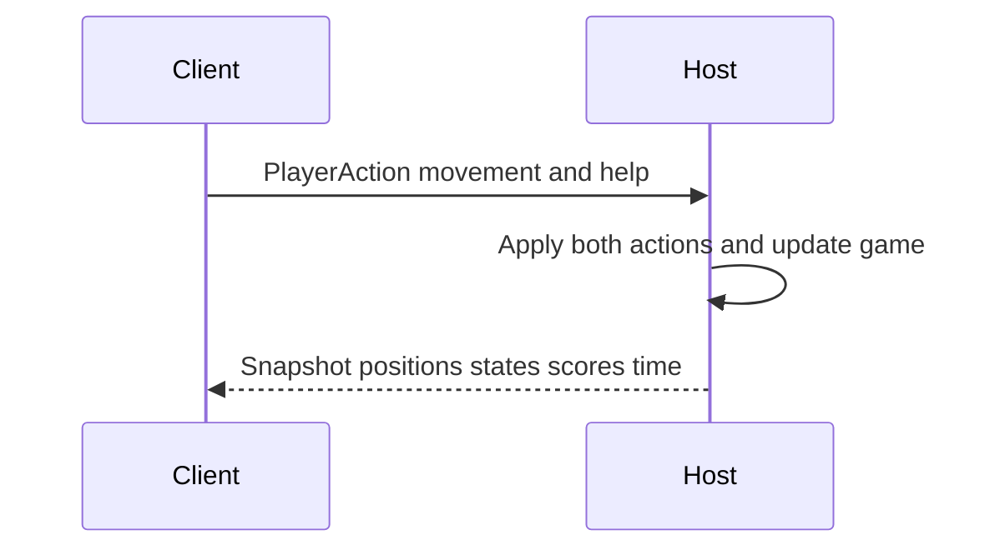

# Cooperative Rescue Game Development Tutorial

This tutorial builds the C# SplashKit rescue game in three iterations. The first version has one responder and no walls. The second adds walls and A* pathfinding. The third adds a second player through a local network connection. The focus is on *why* navigation and networking are needed, and on how the classes work together.

The tutorial assumes you already have a working SplashKit C# project. Put each class in its own `.cs` file under the same `CooperativeRescue` namespace. If your project uses `RescueGame` instead, use that namespace consistently in every file. SplashKit's [Windows installation guide](https://splashkit.io/installation/windows-msys2/) covers initial setup. SplashKit searches for image files in `Resources/images` ([resources reference](https://splashkit.io/api/resources/)).

## What the finished game does

- Player 1 runs the **host**; Player 2 runs the **client**. Open both instances on one computer.
- Each player moves with the arrow keys and presses Space to help a nearby rescuee.
- Three `WalkingRescuee` objects follow their leader. Three `InjuredRescuee` objects must be carried. Carrying reduces responder speed.
- Taking a walking rescuee to the exit gives the helper one point; an injured rescuee gives two points.
- The round lasts five minutes or ends when everyone is safe. The higher score wins; equal scores are a draw.

The PNGs for the responders, rescuees and exit are visual resources. Positions, walls and the exit rectangle remain the game rules. In particular, resizing a PNG does not automatically change collision or help range.

## File plan

| File | Main job | First needed |
| --- | --- | --- |
| `Program.cs` | Window, keyboard and main loop | Iteration 1 |
| `GameSession.cs` | Game rules, scores, updates and drawing | Iteration 1 |
| `Responder.cs` | Player movement and carrying | Iteration 1 |
| `Rescuee.cs` | Shared rescuee contract | Iteration 1 |
| `WalkingRescuee.cs` | Following behaviour | Iteration 1 |
| `InjuredRescuee.cs` | Carrying behaviour | Iteration 1 |
| `RescueMap.cs` | Bounds, exit, walls and pathfinding | Iteration 1; expanded in 2 |
| `Messages.cs` | Input and snapshot records | Iteration 3 |
| `Link.cs` | TCP messages between instances | Iteration 3 |

## Iteration 1: one player, no walls

### Step 1: define the objects

`Responder` has an ID and a position. `Move` applies keyboard input, normalises diagonal movement, and checks whether the next position is allowed by `RescueMap`. Its private `_carried` reference tells it whether to use normal speed (`130f`) or carrying speed (`80f`).

An abstract `Rescuee` stores `Id`, `Position` and `IsSafe`. It requires subclasses to implement `State`, `RescuerId`, `TryAcceptHelp` and `Update`:

```csharp
public abstract class Rescuee
{
    public int Id { get; }
    public Point2D Position { get; protected set; }
    public bool IsSafe { get; private set; }

    public abstract RescueeState State { get; }
    public abstract int? RescuerId { get; }
    public abstract bool TryAcceptHelp(Responder responder);
    public abstract void Update(float deltaTime, RescueMap map);

    public virtual void ReachExit() => IsSafe = true;
    // Add constructors that set Id and Position.
}
```

`WalkingRescuee` keeps a private `_leader`. On a successful `TryAcceptHelp`, it saves the responder and changes from `Waiting` to `Following`. `InjuredRescuee` keeps a private `_carrier`. It accepts help only if the responder is nearby, is not already carrying someone, and the injured rescuee is not safe or already carried. It calls `responder.PickUp(this)`; in `Update`, its position becomes the carrier's position. When it reaches the exit, `ReachExit` calls `responder.Drop()`.

For a wall-free first version, the walking rescuee can move directly toward its leader:

```csharp
float dx = _leader.X - X;
float dy = _leader.Y - Y;
float distance = MathF.Sqrt(dx * dx + dy * dy);

if (distance > 0f)
{
    float step = MathF.Min(100f * deltaTime, distance);
    Position = SplashKit.PointAt(
        X + dx / distance * step,
        Y + dy / distance * step);
}
```

`deltaTime` is elapsed time in seconds. Multiplying speed by `deltaTime` makes movement depend on time rather than the number of frames. Dividing by `distance` gives a direction of length one. `MathF.Min` prevents overshooting the leader.

### Step 2: run one game session

`GameSession` owns one `Responder`, a list of `Rescuee` objects and a wall-free `RescueMap`. In each frame: read the keyboard, call `Apply` to move and help, call `Update` on each rescuee, check the exit, then draw. A person who is still `Waiting` should not be marked safe merely because their starting position lies inside the exit.

**Try it:** Move beside each type and press Space. Check that the walking rescuee follows, the injured one moves with the responder, and neither can be rescued twice. These rules can be checked before adding walls.

## Iteration 2: one player with walls and A*

### Step 3: see why the straight line fails

Put a wall between a walking rescuee and the responder. The direct movement above aims *through* the wall. A collision check can stop movement into the wall, but it cannot tell the rescuee whether to go above or below it. We need a route around obstacles. A* searches a small grid of walkable cells and returns a list of cells leading toward the responder.

The current map has bounds `(20, 60, 760, 520)` and uses `CellSize = 20`. That gives `38` columns and `26` rows. These are logical cells for navigation; the game's pixel coordinates and artwork are separate. The exit is a rectangle checked by `AtExit`.

### Step 4: convert positions to grid cells

`ToCell` subtracts the map's origin, divides by 20, and clamps the result inside the grid. `CellCentre` reverses that operation for movement:

```csharp
public (int x, int y) ToCell(Point2D position)
{
    int column = Math.Clamp((int)((position.X - MapBounds.X) / CellSize), 0, Columns - 1);
    int row = Math.Clamp((int)((position.Y - MapBounds.Y) / CellSize), 0, Rows - 1);
    return (column, row);
}

public Point2D CellCentre((int x, int y) cell)
{
    return SplashKit.PointAt(
        MapBounds.X + (cell.x + 0.5) * CellSize,
        MapBounds.Y + (cell.y + 0.5) * CellSize);
}
```

For example, the first cell centre is `(30, 70)`, because the bounds start at `(20, 60)` and half a cell is 10 pixels. `Passable(cell)` must reject cells outside the grid or inside a wall. In this version the walls are **20 pixels thick**, matching the grid size. With thinner walls, a cell-centre test could miss a wall, and a fast moving character could step across it.

### Step 5: implement A* in `RescueMap`

A* explores candidate cells in an order based on two numbers:

- **Cost so far** `g`: the number of steps already taken from the start.
- **Estimated remaining cost** `h`: Manhattan distance to the goal, `|dx| + |dy|`.

The priority is `g + h`. `PriorityQueue` chooses the smallest value. `cameFrom` remembers how each cell was reached so the route can be rebuilt after reaching the goal. The code below is the core algorithm; use the existing `CanStandAt`, `ToCell` and `CellCentre` methods in `RescueMap`:

```csharp
private static int Heuristic((int x, int y) a, (int x, int y) b)
    => Math.Abs(a.x - b.x) + Math.Abs(a.y - b.y);

private bool Passable((int x, int y) cell)
{
    if (cell.x < 0 || cell.x >= Columns || cell.y < 0 || cell.y >= Rows)
        return false;

    return CanStandAt(CellCentre(cell));
}

public List<(int x, int y)> FindPath(Point2D from, Point2D to)
{
    var start = ToCell(from);
    var goal = ToCell(to);
    if (!Passable(start) || !Passable(goal)) return new();

    var frontier = new PriorityQueue<(int x, int y), int>();
    var costSoFar = new Dictionary<(int x, int y), int> { [start] = 0 };
    var cameFrom = new Dictionary<(int x, int y), (int x, int y)>();
    frontier.Enqueue(start, 0);

    while (frontier.TryDequeue(out var current, out _))
    {
        if (current == goal)
        {
            var path = new List<(int x, int y)> { goal };
            while (path[^1] != start)
                path.Add(cameFrom[path[^1]]);
            path.Reverse();
            return path;
        }

        var neighbours = new (int x, int y)[]
        {
            (current.x + 1, current.y),
            (current.x - 1, current.y),
            (current.x, current.y + 1),
            (current.x, current.y - 1)
        };

        foreach (var next in neighbours)
        {
            if (!Passable(next)) continue;
            int newCost = costSoFar[current] + 1;

            if (!costSoFar.TryGetValue(next, out int oldCost) || newCost < oldCost)
            {
                costSoFar[next] = newCost;
                cameFrom[next] = current;
                frontier.Enqueue(next, newCost + Heuristic(next, goal));
            }
        }
    }

    return new(); // No route.
}
```

With four-direction movement, Manhattan distance does not overestimate the number of steps. When all moves cost one, this helps A* find a shortest route. The method returns an empty list if either endpoint is blocked or there is no route. `cameFrom` is not a list of future moves: it stores each cell's predecessor, so we trace *backwards* and then reverse the result.

### Step 6: make the walking rescuee follow the route

Replace straight-line following with two jobs. First, ask `map.FindPath(Position, _leader.Position)` for a route. The first item is the current cell, so start at index 1 when possible. Replan when the leader enters a different cell or every `0.25f` seconds, whichever comes first. Second, move toward `map.CellCentre(_route[_nextCell])`. Once within about 2 pixels of that centre, advance `_nextCell`. Limit the distance moved in one update to `100f * deltaTime`, and check X and Y movement against `map.CanStandAt` separately so a rescuee can slide along a wall.

```csharp
// In WalkingRescuee.Update, after checking IsSafe and _leader:
UpdateRouteToLeader(deltaTime, map);
if (_nextCell < _route.Count)
    MoveAlongRoute(deltaTime, map);
```

Keeping `UpdateRouteToLeader` and `MoveAlongRoute` as separate private methods makes the algorithm easier to explain and debug. **Try it:** Stand on the other side of a wall, help a walking rescuee, then move around the obstacle. It should follow the open route instead of pushing against the wall. Also test a blocked goal: an empty route should safely mean no movement.

## Iteration 3: two players with networking

### Step 7: choose one authority for game rules

Two windows are two separate processes. They do not share their `GameSession` objects or memory. If both independently update rescuees and scores, small differences in timing or input arrival could make their games disagree. Instead, the **host** runs the authoritative simulation. The client sends input and draws the latest state received from the host.



The two processes communicate over the loopback address `127.0.0.1`, so both instances can run on one computer. `Link.AcceptAsync(port)` waits on the host; `Link.ConnectAsync(port)` joins from the client. `Link` wraps a TCP stream with a reader and writer. Each message is JSON followed by a newline; the background receive loop adds complete lines to a thread-safe queue. The drawing loop calls `TryRead` without blocking while waiting for the next message.

### Step 8: define the two message types

Use records in `Messages.cs` to describe input and visible state. `Point2D` contains public fields, so `Link.JsonOptions` sets `IncludeFields = true` for JSON serialization.

```csharp
public record PlayerAction(float DeltaX, float DeltaY, bool Help);

public record PersonState(
    int Id, Point2D Position, bool Safe,
    RescueeState State, int? CarrierId);

public record Snapshot(
    Point2D Player1Position,
    Point2D Player2Position,
    IReadOnlyList<PersonState> People,
    float TimeLeft,
    int Player1Score,
    int Player2Score);
```

`CarrierId` tells the client whether to draw `player-1-injured-rescuee.png` or `player-2-injured-rescuee.png`. A carried rescuee is not drawn separately. `GameSession.Capture()` builds a snapshot *after* the host updates the game. `Draw(Snapshot state)` draws from that snapshot on **both** windows; the client's local `GameSession` is not its source of rescuee positions or scores.

### Step 9: connect the host and client loops

Run one instance with `host` and one with `client`. `Program.Main` assigns player index 0 to the host and index 1 to the client. The simplified host loop is:

```csharp
// Read all queued input from the client.
while (link.TryRead(out string? message))
{
    if (message == null) return; // Other instance disconnected.

    if (TryDeserialize(message, out PlayerAction? received))
    {
        remoteAction = received with
        {
            Help = remoteAction.Help || received.Help
        };
    }
}

game.Apply(0, localAction, seconds);  // Host is Player 1.
game.Apply(1, remoteAction, seconds); // Client is Player 2.
remoteAction = remoteAction with { Help = false };
game.Update(seconds);
visibleState = game.Capture();
link.Send(visibleState);
```

The `||` matters. Several client actions may arrive in one host frame. If the client presses Space and a later movement message has `Help = false`, keeping only the last message would lose the press. The host combines all pending `Help` values, uses the press once, and then clears it. The latest movement values remain available until replaced.

The client loop sends its current input and takes the latest snapshot:

```csharp
link.Send(localAction);
while (link.TryRead(out string? message))
{
    if (message == null) return;
    if (TryDeserialize(message, out Snapshot? received))
        visibleState = received;
}

game.Draw(visibleState);
```

Keep networking separate from the game rules: `Link` transports messages; `GameSession` decides what a help press does, who earns points and when the round ends. The host sends scores and the winner through the snapshot, so both windows agree. Generate random walls with the **same fixed seed** in each instance, or send the wall layout in the snapshot. If temporary maps are created to validate candidate walls, load the exit bitmap once and pass the same bitmap to each `RescueMap` constructor.

### Step 10: test the final version

1. Start `dotnet run -- host` in one terminal, then `dotnet run -- client` in another. The host waits for the connection.
2. Move both responders and check that each window shows both positions.
3. Let each player help one walking rescuee. Check that ownership and points go to the correct player at the exit.
4. Carry an injured rescuee. Confirm slower movement, the correct combined PNG, and two points on rescue.
5. Press Space while several movement messages are queued; confirm the help press is not lost.
6. Let the timer reach zero, or rescue all six. Check that both windows show the same winner or draw.

## The four OOP principles in the final game

| Principle | Concrete example |
| --- | --- |
| Abstraction | `Rescuee` defines the common `TryAcceptHelp` and `Update` operations; `RescueMap` exposes navigation operations without making callers implement A*. |
| Encapsulation | `Responder` changes its position through `Move`; `InjuredRescuee` keeps `_carrier` private; `GameSession` owns scores and the timer. |
| Inheritance | `WalkingRescuee` and `InjuredRescuee` inherit shared identity, position and safety behaviour from `Rescuee`. |
| Polymorphism | `GameSession` stores a `List<Rescuee>` and calls `Update` or `TryAcceptHelp`; each concrete rescuee runs its own implementation. |

The network, bitmaps and pathfinding extend the project beyond the core OOP requirements, while the rescuee hierarchy keeps the four principles visible in the code and gameplay.
